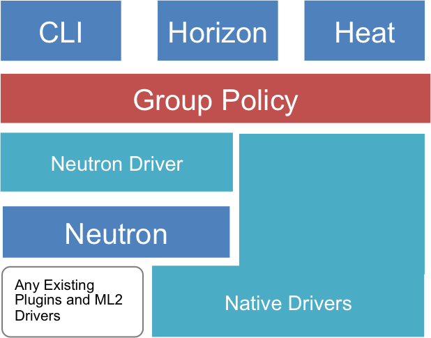
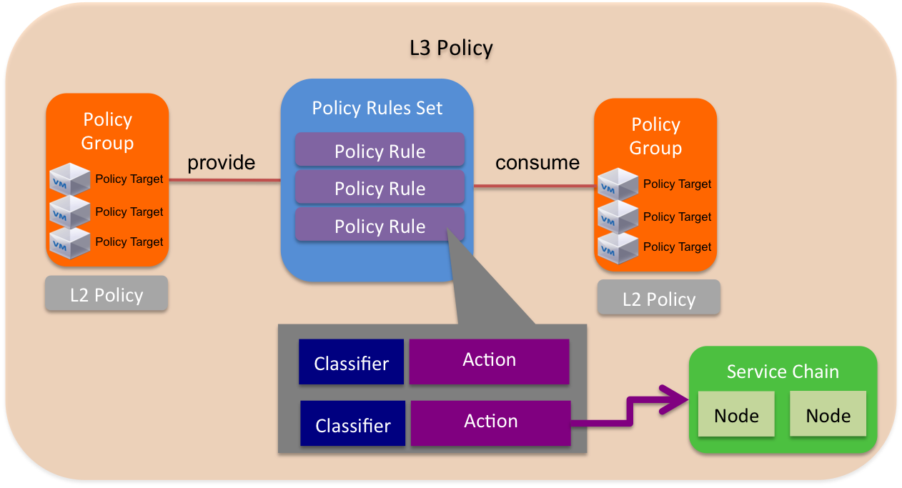
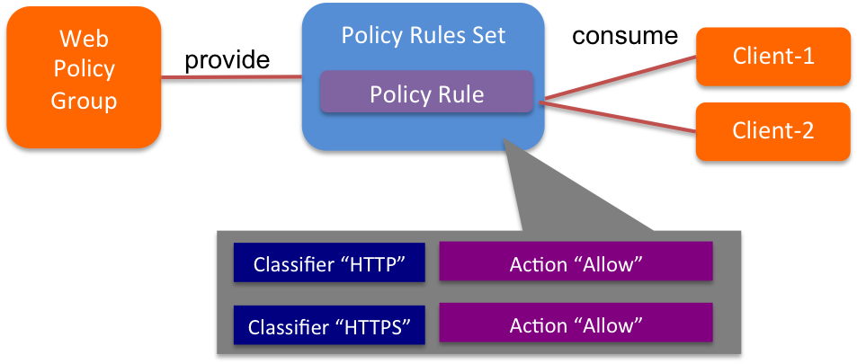

========
Overview
========

.. _whatisgbp:

1. What is Group-Based Policy
=============================

Group-Based Policy (GBP) is an API framework for OpenStack that offers an intent-driven model intended to describe application requirements in a way that is independent of underlying infrastructure.  Rather than offer network-centric constructs like Layer 2 domains, GBP introduces a generic "Group" primitive along with a policy model to describe connectivity, security, and network services between groups.  To date, while GBP has focused on the networking domain, it ultimately can be a generic framework that extends beyond networking as well.

GBP runs as a service plugin within the Neutron process space but in the future may be separated out to a separate server as it develops.

.. _whygbp:

2. Why Use GBP?
===============

GBP was designed to offer a powerful but simple language for capturing the requirements of and deploying complex applications on OpenStack clouds.  It addresses the disconnect between application developers who understand application requirements and infrastructure teams who understand various infrastructure capabilities.

It offers a number of important capabilities beyond what is present in OpenStack today:

1. Dependency mapping: GBP enables users to specify the relationships between different tiers of applications.  This dependency map acts as documentation for the security requirements of the application and allows different tiers of the application to evolve separately.  It also makes it extremely easy to scale and automate infrastructure.

2. Separation of concerns: GBP was designed to separate out application security requirements (ie. who can talk to who) from network-specific requirements (what IP address ranges to use, where to draw network boundaries, how to assign VIPs, etc.).  This allows application, security, and operation teams to operate independently but cooperatively.

3. Network service chaining: GBP offers an abstraction for network services and allows users to describe requirements for chaining multiple network services as part of an application deployment.

.. _architecture:

3. How does GBP work
====================

Group-Based Policy offers a new policy API through multiple OpenStack interfaces including Horizon extensions (group-based-policy-ui), Heat (group-based-policy-automation), and cli (group-based-policy-client).  It was designed to act as a layer on top of Neutron (and in the future other OpenStack services).  GBP itself supports two forms of mapping to underlying infrastructure:

1. Neutron Mapping Driver: The Neutron mapping driver converts GBP resources into existing Neutron API calls.  This allows Neutron to run any existing open source or vendor plugin, including ML2.  It also allows GBP to be used in any OpenStack environment.  At this time, use of both the GBP and Neutron APIs as end user facing APIs in parallel is not supported.

2. Native Drivers: It is also possible to create drivers that directly render policy constructs through a separate SDN controller or external entity without first converting them to Neutron APIs.  This is valuable as it gives the controller additional flexibility on how to interpret and enforce policy without being tied to L2/L3 behaviors.  There are currently four native drivers including Cisco APIC, Nuage Networks, One Convergence, and OpenDaylight.

.. _model:

4. The GBP model
================

GBP introduces a policy model to describe the relationships between different logical groups or tiers of an application.  The primitives have been chosen in a way that separates their semantics from underlying infrastructure capabilities.  Resources may be public or local to a specific tenant.  The key primitives are:

========================= ===================================================
   Resource                       Description
========================= ===================================================
Policy Target             An individual network endpoint (generally a NIC).  A Policy Target is a basic addressable unit in the architecture.
Policy Group              Policy Targets with the same properties are organized into Policy Groups, which is the fundamental primitive of GBP.  Policy Groups offer an infrastructure agnostic grouping construct without specifying any network semantics (like broadcast). Each group models its dependencies by declaring Rule Sets it provides to groups as well as Rule Sets it will consume.
Policy Classifier         A means of filtering network traffic including protocol, port range, and direction (in, out, or bidirectional).
Policy Action             An action to take when a particular rule is applied.  The supported types include "allow" and "redirect" although additional types will be offered in the future.
Policy Rules              Consist of classifier - action pairs
Policy Rule Sets          Policy Rule Sets contain a number of Policy Rules.  Rule Sets may be nested through parent child relationships.

========================= ===================================================

.. _chaining:

5. Network Service Chaining
===========================

Network service chaining is a key capability of GBP.  The goal is to describe the requirements for ordered chains of services by separating out network specific policies from service specific details.

========================= ===================================================
   Resource                       Description
========================= ===================================================
Service Chain Nodes       Logical devices providing network services of a particular type (LB, firewall, etc.)
Service Chain Spec        Ordered grouping of service chain nodes.  Specs may be used in the defintion of a "redirect" action.
Service Chain Instance    Specific instantiation of service chain spec between Policy Groups.  Instances are created automatically when a service chain is activated as part of a Rule Set.
========================= ===================================================

.. _network_policy:

6. Network Policies
====================

GBP aims to centralize the description of network policies and keep them separate from application-level policies (such as Groups and Rule Sets).  This allows separation of concerns between application owners and cloud/infrastructure administrators.

========================= ===================================================
   Resource                       Description
========================= ===================================================
L2 Policy                 Specifies set of groups within the same switching domain.  In the future, this policy will specify whether or not broadcast is enabled in this domain.  L2 policies must reference a particular L3 policy.
L3 Policy                 Specifies potentially overlapping IP address space containing any number of L2 policies.
Network Service Policy    Specifies network specific parameters required for network service chaining, such as VIP allocation, etc.
========================= ===================================================

.. _example:

9. Neutron Mapping Driver
=========================

One of the most useful aspects of the GBP model and its implementation is the ability to map a policy directly into the Neutron API and thus be able to use existing Neutron plugins as is.  The mapping is as follows:

========================= ===================================================
   GBP Resource                     Neutron
========================= ===================================================
Policy Target             Port
Policy Target Group       Subnet
L2 Policy                 Network
L3 Policy                 Router
========================= ===================================================

Note that the above is one way to do the Neutron mapping, but one can design a custom mapping and implement it in a "resource mapping" policy driver.

8. GBP Example - A Simple Multi-Tier App
========================================

Here is an example of how to create a simple policy using GBP.  This policy creates two groups and Policy Rule Set between them.

1. Set Up Rules and Rule Set

::

   # Create Allow Action
   gbp policy-action-create allow --action-type allow

   # Create HTTP Rule
   gbp policy-classifier-create web-traffic --protocol tcp --port-range 80 --direction in
   gbp policy-rule-create web-policy-rule --classifier web-traffic --actions allow

   # Create HTTPs Rule
   gbp policy-classifier-create secure-web-traffic --protocol tcp --port-range 443 --direction in
   gbp policy-rule-create secure-web-policy-rule --classifier secure-web-traffic --actions allow

   # WEB RuleSet
   gbp policy-rule-set-create web-ruleset --policy-rules web-policy-rule

Step 1 creates a rule set describing a policy for a set of web servers. The rule set consists of a set of rules containing classifiers designed to match a portion of the traffic and actions for dealing with that traffic. Common actions include actions to allow or redirect traffic to a network service.

2. Create Groups and Associate Rule Sets

::

   # Group creation
   gbp group-create web
   gbp group-create client-1
   gbp group-create client-2
   # RuleSet Association
   gbp group-update client-1 --consumed-policy-rule-sets "web-ruleset=scope"
   gbp group-update client-2 --consumed-policy-rule-sets "web-ruleset=scope"
   gbp group-update web --provided-policy-rule-sets "web-ruleset=scope"

Step 2 creates the groups and attached the appropriate rule sets. Rule sets describe a bidirectional set of rules. However, the API is designed to allow a group to “provide” a rule set describing its behavior, and other groups to “consume” that rule set to connect to it. The model intends for groups to provide rule sets that describe their behavior, which other groups can then choose to access.

3. Create Group Members

::

   # Create Policy-targets(members) as needed
   gbp policy-target-create --policy-target-group web web-1
   gbp policy-target-create --policy-target-group client-1 client-1-1
   gbp policy-target-create --policy-target-group client-2 client-2-1

Step 3 creates a number of members within each group. Each member inherits all the properties of the group to specify its connectivity and security requirements.

9. GBP Deployment
========================================

For information on deploying GBP, please see https://wiki.openstack.org/wiki/GroupBasedPolicy#Try_Group-based_Policy.
